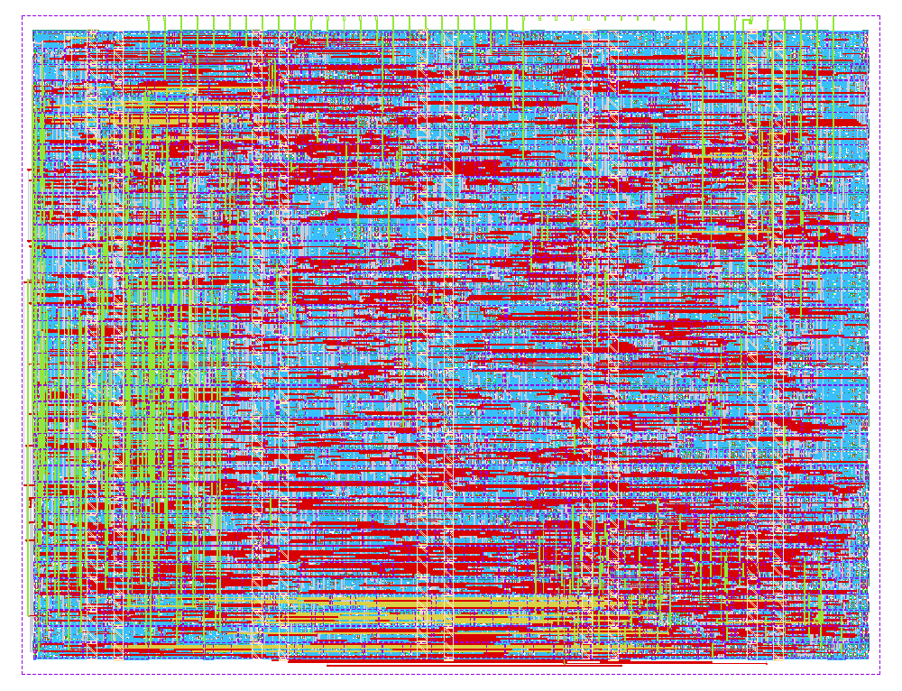

# Strona główna

**Koło Naukowe BAZA, Politechnika Warszawska · ZT · PN · MK · JT · KK**

Projekt powstał w ramach **IEEE Open Silicon Initiative**. Dziękujemy IEEE EDS,
IEEE SSCS, IEEE CASS, IEEE CEDA i IEEE Nanotechnology Council za finansowanie
programu oraz Tiny Tapeout za partnerstwo w ścieżce wytworzenia układu.

Witaj w D00RSH Wiki

Dokumentacja użytkowa układu uwierzytelniającego <b>D00RSH</b>. Znajdziesz tu instrukcję uruchomienia, opis połączeń, protokół komunikacyjny i parametry demonstratora.

<aside class="infobox">
<strong>D00RSH</strong>

<dl><dt>Technologia</dt><dd>IHP SG13G2</dd><dt>Format</dt><dd>Tiny Tapeout 1×1</dd><dt>Zegar</dt><dd>1 MHz</dd><dt>Szyfr</dt><dd>SIMON64/128</dd><dt>Interfejs</dt><dd>SHIFT64</dd><dt>Klawiatura</dt><dd>matryca 4×4</dd></dl>
</aside>

## O układzie

D00RSH dopuszcza **jedną transakcję challenge–response po poprawnym PIN-ie**.
Urządzenie nadrzędne wysyła 64-bitowy challenge i odbiera jego zaszyfrowaną
odpowiedź. Układ wykorzystuje jeden klucz 128-bitowy i pełne 44 rundy SIMON64/128.

Gotowość sygnalizuje wyjście **CHALLENGE_READY**. Błędny PIN nie uruchamia
komunikacji; trzeci błędny PIN blokuje kolejne próby do zimnego resetu.

To demonstrator z publicznym kluczem i ulotnym licznikiem prób.
Przed użyciem przeczytaj [zakres bezpieczeństwa](bezpieczenstwo.md).

<section class="portal-box">
<h2>Manual użytkownika</h2>
<ul><li><a href="uruchomienie.html">Pierwsze uruchomienie krok po kroku</a></li><li><a href="pinout.html">Podłączenie i tabela pinów</a></li><li><a href="klawiatura.html">Wpisywanie PIN-u i klawisze specjalne</a></li><li><a href="diagnostyka.html">Rozwiązywanie problemów</a></li></ul>
</section>
<section class="portal-box">
<h2>Interfejs hosta</h2>
<ul><li><a href="protokol.html">Ramki SHIFT64 i kolejność bitów</a></li><li><a href="czasy.html">Wymagania czasowe</a></li><li><a href="czasy.html#reset-i-dezaktywacja">Reset i dezaktywacja</a></li><li><a href="uruchomienie.html#wektor-demonstracyjny">Wektor demonstracyjny</a></li></ul>
</section>
<section class="portal-box">
<h2>Dokumentacja układu</h2>
<ul><li><a href="schemat.html">Funkcjonalny schemat blokowy</a></li><li><a href="layout.html">Render layoutu i parametry fizyczne</a></li><li><a href="layout.html#stan-weryfikacji">Stan weryfikacji</a></li></ul>
</section>
<section class="portal-box">
<h2>Bezpieczeństwo i obsługa</h2>
<ul><li><a href="bezpieczenstwo.html">Granice demonstratora</a></li><li><a href="klawiatura.html#limit-blednych-prob">Limit błędnych prób</a></li><li><a href="protokol.html#obowiazki-hosta">Świeżość challenge i weryfikacja odpowiedzi</a></li></ul>
</section>

Kategorie: D00RSH · Układy scalone · Dokumentacja użytkowa

