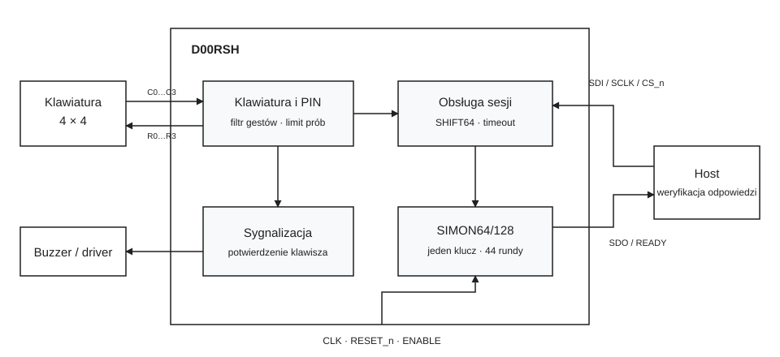

# Schemat blokowy

Widok funkcjonalny pokazuje połączenie IEEE DOORSH z klawiaturą i hostem oraz
główne funkcje użytkowe układu.

<figure class="figure">

<figcaption>Rysunek 1. Funkcjonalny schemat IEEE DOORSH. Strzałki oznaczają kierunek przepływu sygnałów; rysunek nie przedstawia rozmieszczenia na krzemie.</figcaption>
</figure>

## Funkcje

| Funkcja | Rola w systemie |
|---|---|
| Obsługa klawiatury | Skanowanie matrycy, filtrowanie naciśnięć, odrzucanie zaobserwowanego wielokliku |
| Autoryzacja PIN | Porównanie pełnego PIN-u, zliczanie błędów, dopuszczenie jednej transakcji |
| Obsługa sesji | Kontrola ramek, READY, timeout, anulowanie |
| SIMON64/128 | Szyfrowanie 64-bitowego challenge jednym kluczem 128-bitowym |
| Sygnalizacja dźwiękowa | Potwierdzenie przyjętej cyfry lub kasowania częściowego PIN-u |

IEEE DOORSH nie steruje bezpośrednio mechanizmem zamka. Decyzję o zaakceptowaniu
odpowiedzi podejmuje host. Sposób podłączenia opisuje [pinout](pinout.md).
